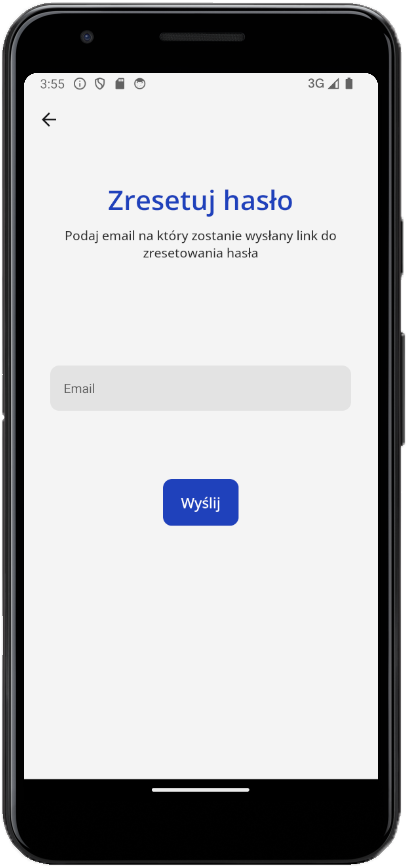
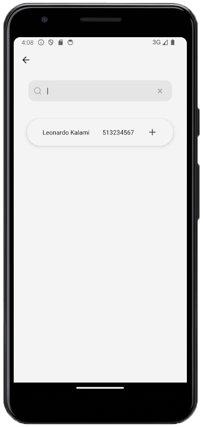
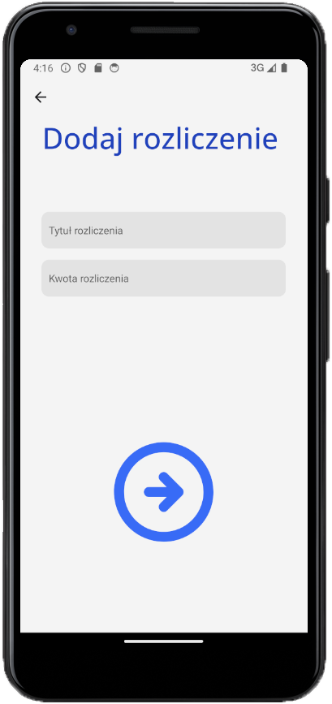

<h1 align="center" style="font-family: 'GFS Didot', serif; font-weight: bold; font-size: 60px;">Sedeo</h1>

<p align="center">
    <b>Frontend for Sedeo financial settlements mobile application.</b>
</p>

<h2 id="introduction">Introduction</h2>

<b>"Sedeo"</b> allows users to divide group expenses and settle them in a simple and practical way.

The application enables users to maintain a list of friends, create themed settlement groups,
and manage individual settlements while considering various division scenarios. Additionally, each user possesses a profile where their settlement account balance is calculated based on settlements across all groups.

<h2 id="started">Getting started</h2>

1. Install dependencies

   ```bash
   npm install
   ```

2. Start the app

   ```bash
    npx expo start
   ```

<h2>Screenshots</h2>

Following screenshots showcase functionalities of the app.

<h2>Login and register screens</h2>
<p align="center">
   
   
</p>

<h2>Reset password screens</h2>
<p align="center">
   
   
</p>

<h2>Profile screens</h2>
<p align="center">
   
   
</p>

<h2>Friends screens</h2>
<p align="center">
   
   
</p>

<p align="center">
   
</p>

<h2>Settlement groups screens</h2>
<p align="center">
   
   
</p>
<p align="center">
   
   
</p>

<h2>Settlement screens</h2>
<p align="center">
   
   
</p>
<p align="center">
   
   
</p>
<p align="center">
   
   
</p>
<p align="center">
   
</p>